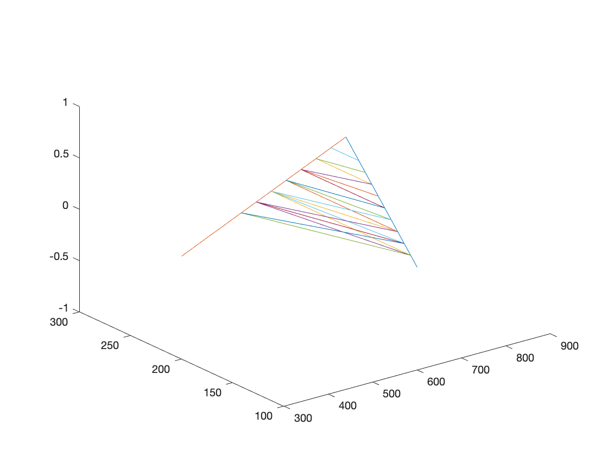
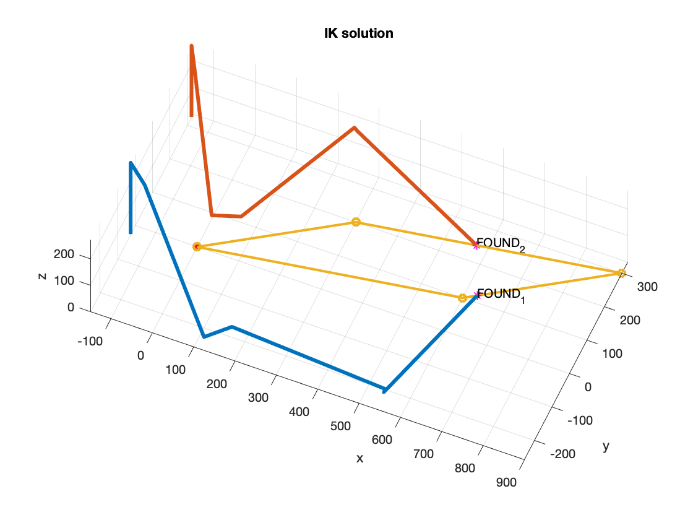

# ELEC4010M/MECH4000J Project2 **Robotic Grasping** 

This individual project is based on Baxter 7-DOF dual-arm robot configurations. Functions implemented are listed below,

- Baxter Forward Kinematics
- Baxter Worksapce
- Baxter Inverse Kinematics
- Application of Inverse Kinematics
- Finding Force Closure Grasps
- Generate Force Closure Grasping Configurations

More information could be referred to the project description.

## Run the code

In order to run the code, please refer to the sample usage in project2.m. Simply **comment the irrelevant sections** and run each task **individually**. Otherwise, the last task will overlap on pervious ones, resulting an incomplete plot of initials. 

To run task1: **Polygon Vertices Input**, please follow the command. 

```matlab
clc, close all;
vertices = input("Please enter a list of vertices");
vertices = poly(vertices);
%example: [0, 0; 600, 100; 900, 300; 300, 200]
```

To run task2: **Friction Coefficient Input**, please follow the command. 

```matlab
friction = input("Please enter the coefficient of friction");
%example: 1
```

To run task3: **Force Closure Grasps**, please follow the command. The detection is through interpreting friction coefficient as the cone size and the line connecting two frictional grasps is supposed to lie within the cone if force closure. 

```matlab
clc, close all;
[pt1_set, pt2_set] = detect_fc(vertices,friction);
```

To run task4: **Grasping Configurations**, please follow the command. Note that the configurations of dual arms could be found in the output. **NO** collision checking is performed at this stage. 

```matlab
clc, close all;
plot_dual(pt1_set,pt2_set,vertices);
```

## Expected results 



Figure1: All possible pairs of two frictional grasping points 



Figure 2: One reachable robot configurations

## Author

**Xinjie Yao** [xyaoab](https://github.com/xyaoab)

## Acknowledgment 

Prof. Jun Seo, Instructor of 2019 Spring ELEC4010M/MECH4000J [Robotic Manipulation and Mobility](https://canvas.ust.hk/courses/22842), HKUST, HK